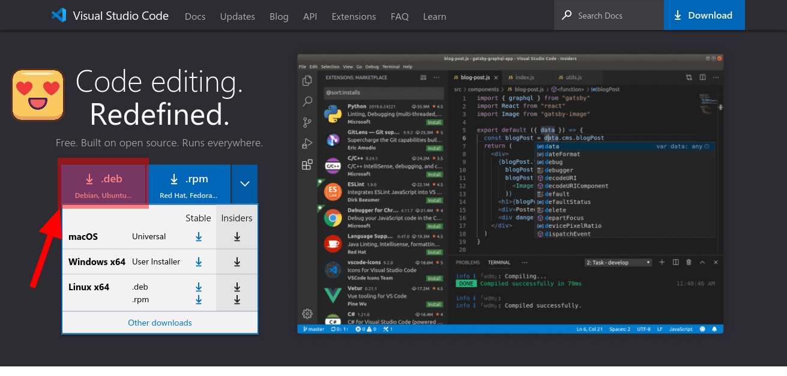

# Setting up development environment
## Visual Studio Code
---
Visual Studio Code is my favorite tool to create code, it is lightweight, full of extensions, compatible with several tools and technologies, comes with GIT integrated into the UI and is an open source project.

To download it just go to the official link:

> https://code.visualstudio.com

The site will likely detect the operating system you are using and suggest the best version for download, if not, you probably know what you are doing.

In my case I will download the .deb file since I run Linux Mint which is based on Ubuntu. If you have another OS, select the appropriate one.



###### VSCode download page on 7/13/2021

## GIT
### Installing
Git is a tool that I fell in love with since the first day I met it, being able to save your change history is very important to reduce the work in dealing with the amount of versions that a file can take when it comes to development.

To install GIT on any UBUNTU-based distro just enter the commands:

```sh
sudo apt update && sudo apt install git-all
```

To check the version do:

```sh
git --version
```

To install on other OS's check the original documentation:

> https://git-scm.com/book/en/v2/Getting-Started-Installing-Git

### Setting
You have to configure a few things to configure GIT correctly.
First let's set up your email and username.
###### Put the same ones from GITHUB if you already intend to use it.

```sh
git config --global user.name username
git config --global user.email email
git config --global core.editor "code --wait"
git config --list

```

Now you can configure the default editor for whatever git needs. By default I use VSCode myself for editing. If you want to use it, put the code below. If not, use instead of "code" the name used to call the program in the terminal.


```sh
git config --global core.editor code
```

Para testar se funcionou você pode fazer:

```sh
git config --list
```

This should show a list with all the keys and values for the settings made.

You can also test if a specific configuration is present, for example:

```sh
git config user.name
```

### Generating SSH
SSH is one of the ways to synchronize GIT with for example GitHub, with SSH you don't need to type the password all the time as is the case with HTTPS.

First check that you are at the root of your terminal:

```sh
cd ~
```
Depois entre com o código abaixo e o email que você possui no serviço de hospedagem que você quer utilizar:

```sh
ssh-keygen -t ed25519 -C "your_email@example.com"
```

When you press enter the following message will appear:

>Enter a file in which to save the key (/home/you/.ssh/id_ed25519): [Press enter]

Just press enter, unless you know what you're doing I don't recommend changing the location. After that the following message will appear:

> Enter passphrase (empty for no passphrase): [Type a passphrase]

> Enter same passphrase again: [Type passphrase again]

Enter the password you deem necessary for your situation, I always put in good passwords!

Now you will need to start ssh-agent with the following command:

```sh
eval "$(ssh-agent -s)"
```

Then the message should appear:
> Agent pid 59566

Caso falhe, tente executar alguns comandos antes:

```sh
sudo -s -H
exec ssh-agent bash
# Ou
exec ssh-agent zsh
```

Now run the command:
```sh
ssh-add ~/.ssh/id_ed25519
```
Ready now just add this key to GITHUB. And how to do this? Follow up!

### Adding SSH to your GITHUB
To complete the configuration of GIT + GITHUB type in the terminal.

```sh
code ~/.ssh/id_ed25519.pub
```

Now just copy everything inside the file that was opened.

Once this is done, go to your GITHUB, enter the symbol of your profile and go to settings:


Then proceed through the sidebar to SSH AND GPG KEYS


Click on new ssh:


In the title field give a description for the SSH key that you can easily identify it.
And in the KEY field paste what we just copied from the file we opened.


Click Add SSH Key:


If prompted, enter your password to validate the addition of the key on your GITHUB.
Ready! Now you can use the SSH option when making your git clone.
