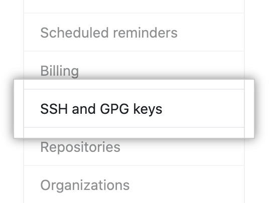

# Configurando ambiente de desenvolvimento para um devweb fullstack
## Visual Studio Code
---
Visual Studio Code é minha ferramenta favorita para criar código, é leve, cheio de extensões, compatível com diversas ferramentas e tecnologias, vem com GIT integrado à UI e é um projeto open source.

Para baixá-lo basta acessar o link oficial:

> https://code.visualstudio.com

O site provavelmente detectará o sistema operacional que você está usando e sugerirá a melhor versão para download, caso contrário, você provavelmente sabe o que está fazendo.

No meu caso vou baixar o arquivo .deb já que executo o Linux Mint que é baseado no Ubuntu. Se você tiver outro sistema operacional, selecione o apropriado.


###### VSCode download page on 7/13/2021

## GIT
### Instalando
O Git é uma ferramenta pela qual me apaixonei desde o primeiro dia que a conheci, poder salvar seu histórico de alterações é muito importante para diminuir o trabalho em lidar com a quantidade de versões que um arquivo pode ter quando se trata de desenvolvimento.

Caso seu SO não seja o Ubuntu, ou deseja uma possível versão mais recente da documentação por favor, entre [aqui](https://git-scm.com/book/pt-br/v2/Come%C3%A7ando-Instalando-o-Git), quando terminar pule essa seção **Instalando** e vá para **Configurando**, porém, se você tem Ubuntu ou uma distribuição baseada em nele(Linux Mint, xubuntu), é só seguir o tutorial digitar os comandos:

```sh
sudo apt update && sudo apt install git-all
```

Para checar a versão faça:

```sh
git --version
```

### Configuração
Você precisa configurar algumas coisas para o GIT funcionar corretamente.
Primeiro, vamos configurar seu e-mail e nome de usuário.
###### Coloque os mesmos do GITHUB caso já pretenda usar.

```sh
git config --global user.name username
git config --global user.email email
```

Agora você pode configurar o editor padrão para qualquer necessidade do git. Por padrão, eu mesmo uso o VSCode para edição. Se você quiser usá-lo, coloque o código abaixo. Caso contrário, use em vez de **code** o nome usado para chamar o programa no terminal.


```sh
git config --global core.editor "code --wait"
```

Para visualizar a lista de configuração feitas:

```sh
git config --list
```
Isso deve mostrar uma lista com todos os valores para as configurações feitas.

Você também pode testar se uma configuração específica está presente, por exemplo:

```sh
git config user.name
```

### Gerando SSH
SSH é uma das maneiras de sincronizar o GIT local com o seu repositório no site do GitHub, por exemplo, com o SSH você não precisa digitar a senha o tempo todo como é o caso do HTTPS.

Primeiro verifique se você está na raiz do seu terminal:

```sh
cd ~
```
Depois entre com o código abaixo e o email que você possui no serviço de hospedagem que você quer utilizar:

```sh
ssh-keygen -t ed25519 -C "your_email@example.com"
```

Ao pressionar enter aparecerá a seguinte mensagem:

>Enter a file in which to save the key (/home/you/.ssh/id_ed25519): [Press enter]

Basta pressionar enter, a menos que você saiba o que está fazendo, não recomendo alterar o local. Após isso aparecerá a seguinte mensagem:

> Enter passphrase (empty for no passphrase): [Type a passphrase]

> Enter same passphrase again: [Type passphrase again]

Digite a senha que achar necessária para sua situação, sempre coloque senhas boas!

Agora você precisará iniciar o ssh-agent com o seguinte comando:

```sh
eval "$(ssh-agent -s)"
```

Em seguida, a mensagem deve aparecer:
> Agent pid 59566

Caso falhe, tente executar alguns comandos antes:

```sh
sudo -s -H
exec ssh-agent bash
# Ou
exec ssh-agent zsh
```

Rode o comando:
```sh
ssh-add ~/.ssh/id_ed25519
```
Pronto agora basta adicionar esta chave ao GITHUB. E como fazer isso? Acompanhamento!

### Adicionando SSH ao seu GITHUB
Para completar a configuração do GIT + GITHUB digite no terminal.

```sh
code ~/.ssh/id_ed25519.pub
```
Agora é só copiar o conteúdo do arquivo que foi aberto, é um monte de letras juntas, eu juro que elas tem significado, mas vamos deixar pra outro dia.

Feito isso, acesse seu GITHUB, digite o símbolo do seu perfil e vá em configurações:


Em seguida, prossiga pela barra lateral para SSH E GPG KEYS



Clique em novo ssh:


No campo de título, forneça uma descrição para a chave SSH que você possa identificá-la facilmente.
E no campo KEY cole o que acabamos de copiar do arquivo que abrimos.


Clique em Adicionar chave SSH:


Se solicitado, digite sua senha para validar a adição da chave em seu GITHUB.
Preparar! Agora você pode usar a opção SSH ao fazer seu clone do git.
Se colocou senha, toda vez que iniciar uma nova seção no seu computador terá que digitar a senha novamente.
Para sanar isso algumas distros oferecem para salvar a senha.
